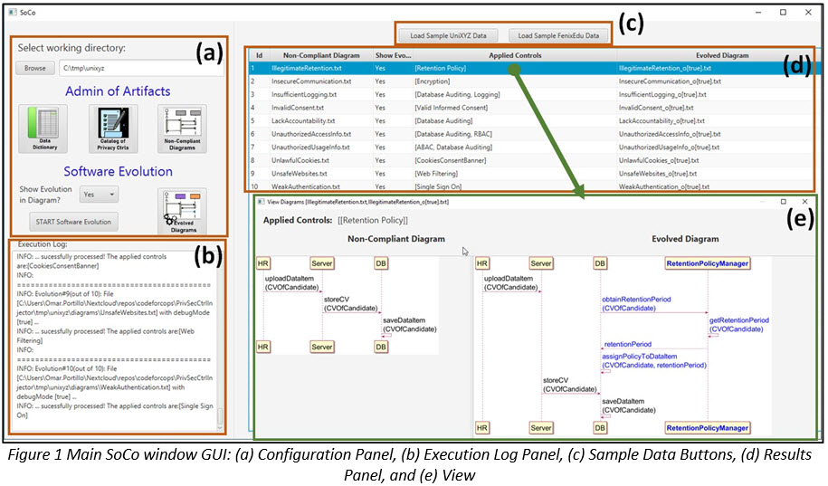
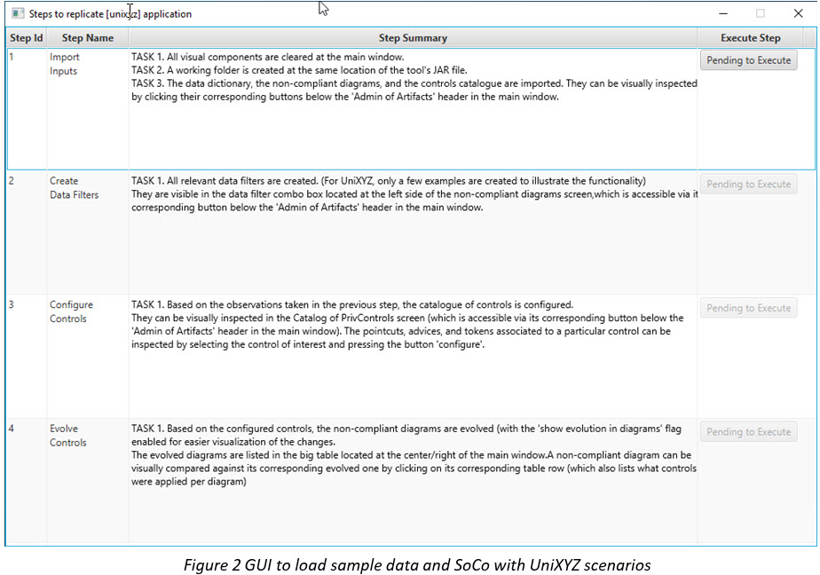

# SoCo
This repository contains the source code for the prototype of SoCo, a semi-automated approach to support organizations in achieving software compliance with the GDPR data protection principles.

Instructions to compile the prototype
----------------------

The prototype has been developed as an Eclipse project. Thus, the easiest way to compile/build it is to import the whole directory as an Eclipse project. Alternatively, there is an ANT build script that can be used to create the JAR file "soco_tool.jar".

Prototype's runtime dependencies
----------------------

1.	In case Java is missing on the computer, please download and install it.
-	URL to download Java Runtime Environment (JRE): https://www.java.com/en/download/manual.jsp
-	Installation instructions: https://docs.oracle.com/goldengate/1212/gg-winux/GDRAD/java.htm

2.	In case JavaFX is missing on the computer, please download and install it.
-	URL to download JavaFX: https://gluonhq.com/products/javafx/
-	Installation instructions: https://docs.oracle.com/javafx/2/installation_2-1/javafx-installation- windows.htm (take note of where JavaFX gets installed, e.g.,"C:\Program Files\Java\javafx-sdk-19\lib”).

How to run SoCo’s tool (only after the above dependencies have been installed)
----------------------
1.	Open a terminal (e.g., Command Prompt in Windows).

2.	Inside the terminal, go to the directory where the tool was downloaded and unzipped (e.g., C:\tmp_soco).

3.	Then run the below line. The main tool window (Fig. 1) will be shown.

```
java --module-path "C:\Program Files\Java\javafx-sdk-19\lib" --add-modules javafx.controls,javafx.fxml
-jar soco_tool.jar -Dlog4j.configurationFile=log4j2.xml
```

Important note:
-	Replace "C:\Program Files\Java\javafx-sdk-19\lib” with the actual path where JavaFX has been installed before running the above command.

4.	From the main window (Fig. 1), click on either the button “Load Sample UniXYZ Data” or “Load Sample FenixEdu Data” (Fig 1.c), depending on which application the user wants to replicate.



5.	A new window will appear showing a 4-row table (As shown in Fig.2)



6.	Each table row represents a step needed to replicate SoCo’s results for the chosen application. Each row has a button to get that step executed. Just click the buttons in the given order to replicate the experimental results presented in the paper. To prevent errors, only the button that needs to be executed at each stage is enabled at a time.

Important notes:
-	The table also offers a brief description of what each step does, including which tool’s screens can be used to see the results of each step.
-	As the window is not modal, the user can freely explore the results of each step (i.e., before executing the next step). Just please make sure not to modify anything in order to prevent accidentally removing anything that the next step might expect.
-	The first three steps are fast, just taking a few seconds. However, the last step is significantly slower (as it involves the injection). You will need to wait until it has finished exploring the final evolved diagrams.

